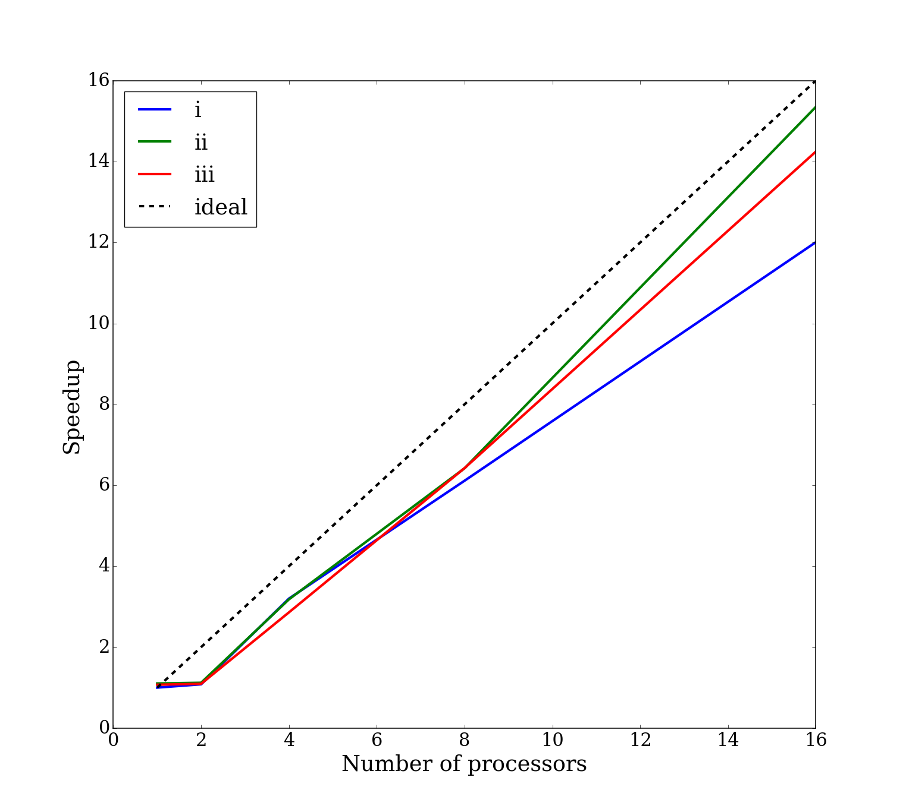
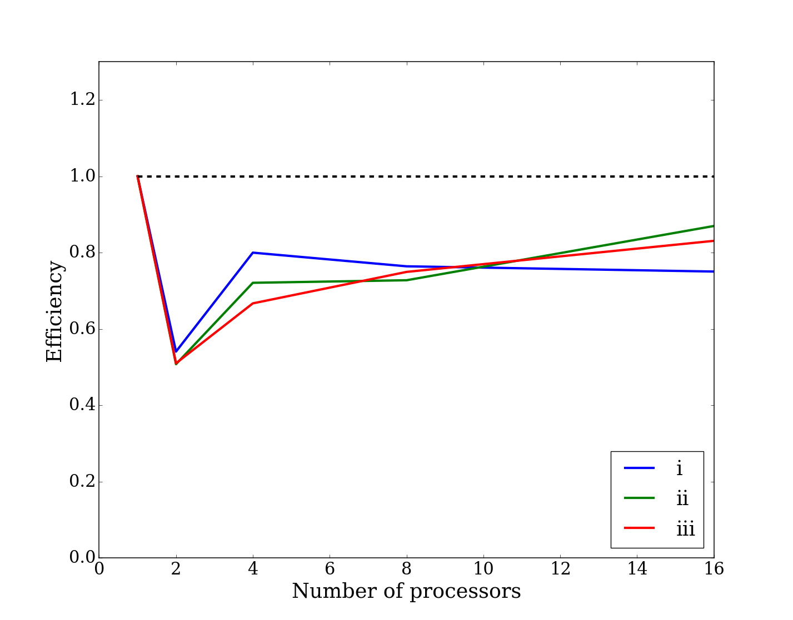

# CME 342 - Homework 1

For access to this homework on github, visit: http://github.com/rehnd/cme342/tree/master/hw1

## Problem 1
My interest in parallel programming deals mostly with solving PDEs for different physical problems. I do research using Density Functional Theory (DFT) and use codes that utilize MPI and OpenMP. I am also interested in GPU computing and Modern Fortran, which uses Coarrays. For a final project, I might like to reprogram the homework assignments using Modern Fortran and Opencoarrays, to see how the performance compares.

## Problem 2
To run this code, make sure you have a valid mpif90 compiler and issue the following:

      $ make all
      $ python run.py
      $ ## or alternatively (to run in parallel:
      $ sbatch run.sbatch
    
By default, the makefile will build a serial executable and 3 parallel executables, each corresponding to the different problem numbers (i, ii, and iii). The run.sbatch file simply requests resources to run the `run.py` python file. The python file loops over the number of processors [1,2,4,8,16] and the problem number ['i','ii','iii'], runs 12 simulations of each, then finds the average wall time of those 12 simulations. 

All executables rely on a single input file called `input.nml`. This file specifies the dimensions of the problem (`n1,n2`) and the number of processors in each direction (`np1,np2`), as well as the number of iterations to run the smoothing (`niter=100`).  The python file therefore modifies this input file during each iteration for use by the executables.

To run executables by themselves, the syntax is as follows (for serial, i, ii, and iii, respectively):
    
    $ ./serial -i input.nml
    $ mpirun -np X ./hw1_i -i input.nml
    $ mpirun -np X ./hw1_ii -i input.nml 
    $ mpirun -np X ./hw1_iii -i input.nml

where X is the number of processors to run with. If X is not equal to `np1*np2`, an error results at runtime.

_______________________________________________________

### Results
Below are plots of the runtime performance for `1,2,4,8,16` processors for `n1 = n2 = 1024` and `niter = 100` for each of the three problems:

  - i:  MPI_Send and MPI_Recv
  - ii: MPI_Sendrecv
  - ii: MPI_ISend and MPI_IRecv

#### Total Walltime

#### Speedup

#### Efficiency

#### Discussion
As can be seen, the larger number of processors are faster than the 1 or 2 processors. It appears that there is an overhead when moving from 1 to 2 processors, likely due to communication costs. Since we only run on 16 cores, we do not see the expected falling-off of the efficiency and speedup. If we were to go to 32 or 64 cores, we would most likely see this fall-off. Additionally, the problem size is relatively small, so the advantage of computing on 2 cores over 1 core should not be expected to be great, since the computational time is likely small compared to the cost of communication. It would be interesting to see how it scales for `n1`, `n2` much larger. The Isend and Irecv could be much faster if we increase the problem size.
