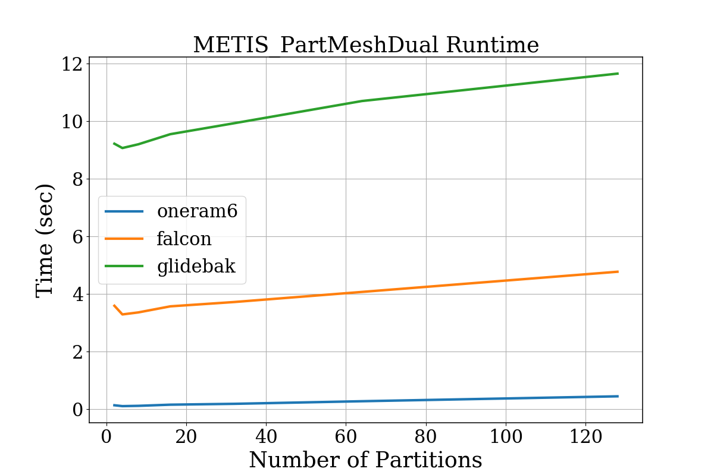
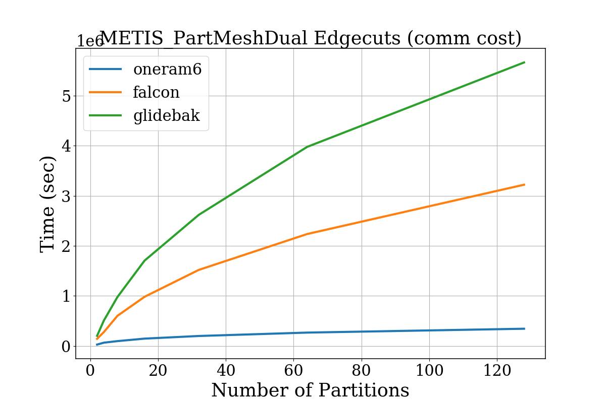
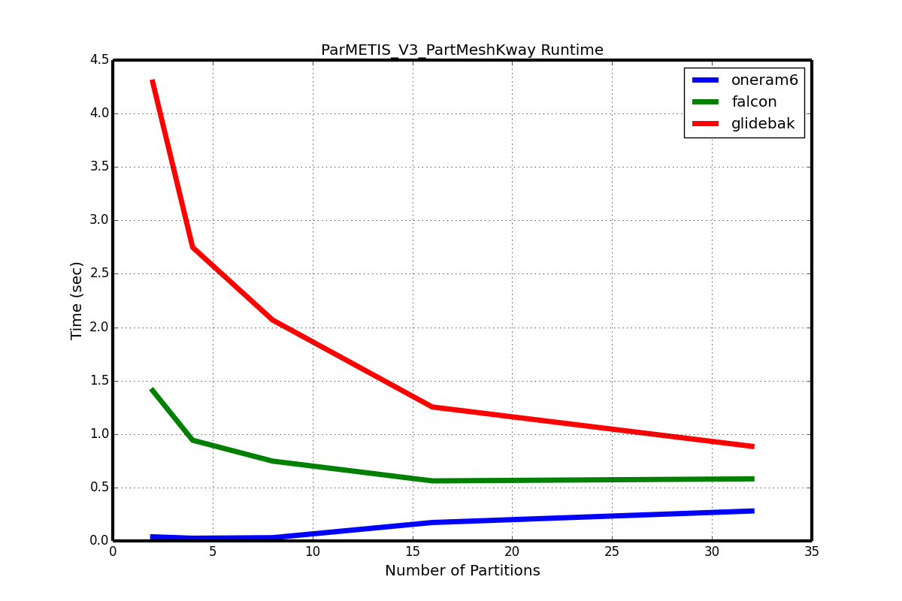

# CME 342 - Homework 2

## 0. Installation

### Prerequisites -- METIS and PARMETIS
First, install both the metis and parmetis libraries:

```bash
$ wget http://glaros.dtc.umn.edu/gkhome/fetch/sw/metis/metis-5.1.0.tar.gz
$ wget http://glaros.dtc.umn.edu/gkhome/fetch/sw/parmetis/parmetis-4.0.3.tar.gz
$ tar xzf metis-5.1.0.tar.gz
$ tar xzf parmetis-4.0.3.tar.gz
$ cd metis-5.1.0
$ make config
$ make
$ cd ../parmetis-4.0.3
$ make config
$ make
```

### Clone repository and build this code

```bash
$ git clone https://github.com/rehnd/cme342.git
$ cd cme342/hw2
```

Now compile the serial code

```bash
$ cd 1-serial
$ make
```

and next, the parallel

```bash
$ cd ~/cme342/hw2/2-parallel
$ make
```

### Executing the code after compilation

The executables require at least three additional command-line options.
An example for the `oneram6` mesh file is the following:

```bash
$ ./serial 2 ../meshes/oneram6.conn ../meshes/oneram6.xyz
```

The correspoding parallel call is

```bash
$ mpirun -np 2 ./parallel 2 ../meshes/oneram6.conn ../meshes/oneram6.xyz
```

where we have run on 2 processors.


## 1. Serial Results

### Serial runtimes

Below is a plot of the total run time vs number of partitions for a serial algorithm



### Serial edgecuts (i.e., communication cost)

This plot shows the communication cost for a given number of
partitions. The communication cost is determined by the so-called
edgecut of the graph.



## 2. Parallel Results

### Parallel Runtimes

For the parallel code, I was only able to run on 4 cores due to a
problem with the cluster I was working on. Still, I plot the runtime
for up to 32 partitions.



### Parallel edgecuts (i.e., communication cost)

Below is a plot of the number of edgecuts vs number of processors.


## 3. Final Project Description

For my final project, I plan to rewrite the first and (possibly) third
homework assignments using OpenCoarrays and the new Fortran `caf`
compiler.

Coarray Fortran is built on MPI, but uses very simple syntax. In this
sense, it is "higher-level" than writing directly in MPI, but the
higher level in this case is usually _much_ better for
performance. The reasons for this have to do with the fact tha Coarray
Fortran uses single-sided communication (`MPI_puts` and `MPI_gets`)
under hood. It also uses MPI derived data types to send data between
nodes. For example, if you plan to send data that is stored
non-contiguously in increments, `caf` has a way of generating an MPI
derived datatype to automatically do the sending for you.

These advanced features in the `caf` compiler make it very likely that
`caf` will greatly outperform standard MPI code. For my project, I
plan to do a runtime analysis of Homework 1 (and possible Homework 3)
using `caf`, and compare that to the MPI solution.