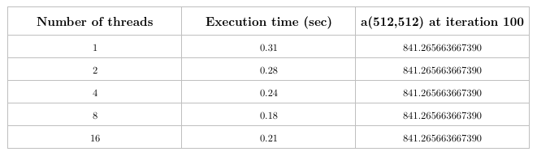
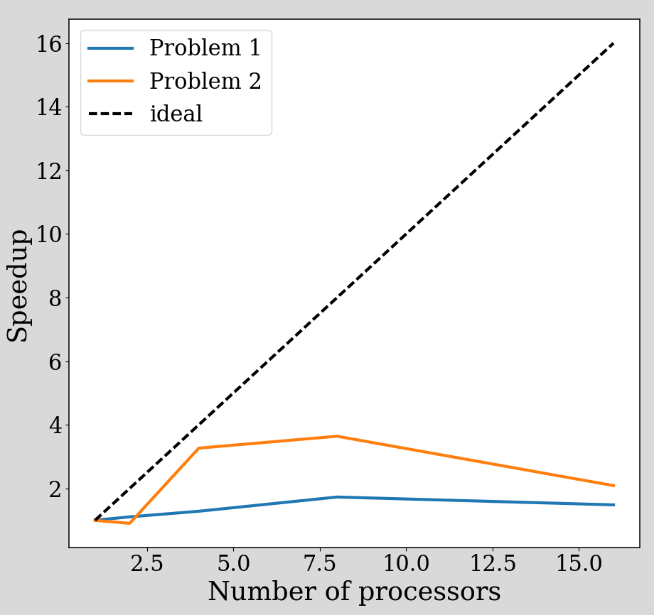
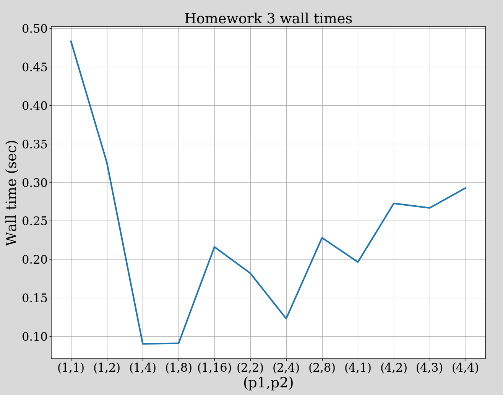
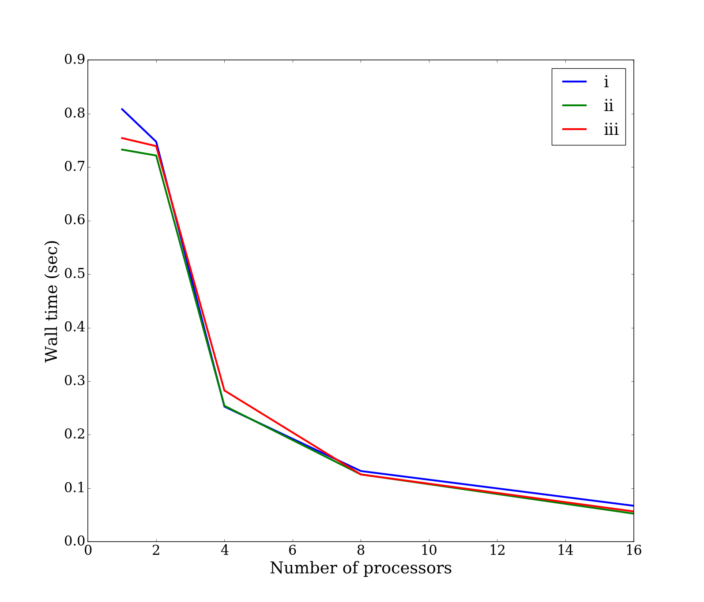

# CME 342 - Homework 3

## Problem 1

The file `hw3_1_pardo.f90` contains my solution to this problem. I
ran the code for [1,2,4,8,16] threads. However, my processor only has
8 cores, so the 16 thread runtime is worse than the 8 thread runtime,
as should be expected. 

The table of number of threads, execution times (averaged over 11
trials per datapoint), and value of `a(512,512)` is shown below.

A plot of speedup is shown here:

As can be seen, the speedup is not all that great using OpenMP. The
reason for this is not entirely clear, however it is possible that
because I used an Intel compiler on a Xeon Phi machine, the serial
version might already be doing some vectorization by default. This
would limit the speedup using OpenMP for multiple threads. It may also
be possible that using a larger matrix would help to show speedup
closer to the ideal value.

## Problem 2

My code for this part is found in `hw3_2_parregions.f90`. We are asked
to show results for 

	p1, p2: (1,1), (1,2), (1,4), (1,8), (1,16), 
	        (2,2), (2,4), (2,8), 
			(4,1), (4,2), (4,3), (4,4)

These results are shown in the figure below.

## Problem 3
The run times for hw3 and hw1 are shown below.  As can be seen, the
magnitude of the wall time is smaller for hw3 than for hw1, but the
speedup in hw1 (MPI) is better than in hw3. Note that the 16 processor
case is not really a fair comparison because I ran on a node with only
8 cores, so OpenMP does not scale as well using 16 threads, while
under the MPI version, I used another node to get 16 cores total.

#### Homework 3 wall times

#### Homework 1 wall times

Overall, OpenMP has a lower runtime overall, while MPI scales better
as the number of cores increases. There are many differences between
the two, such as their memory overhead: in the MPI code, each core
only has to refer to a small subset of the 1024x1024 array, while the
OpenMP code has to store the entire array. This could lead to worse
cache/memory performance in the OpenMP case because all 8 cores are
reading and writing to the same array at different times. On the other
hand, the MPI code has communication costs, and OpenMP does
not. 
