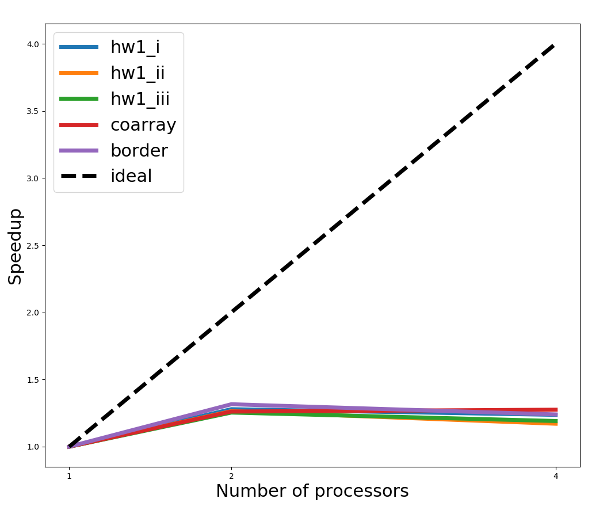
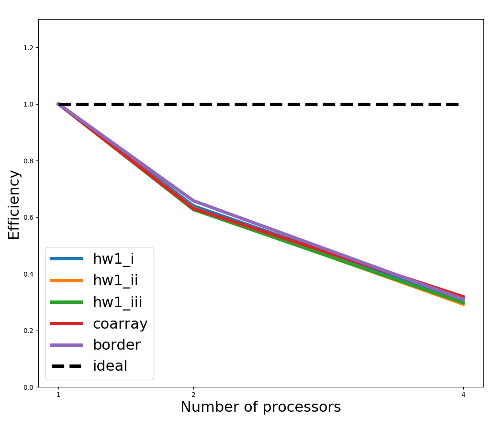
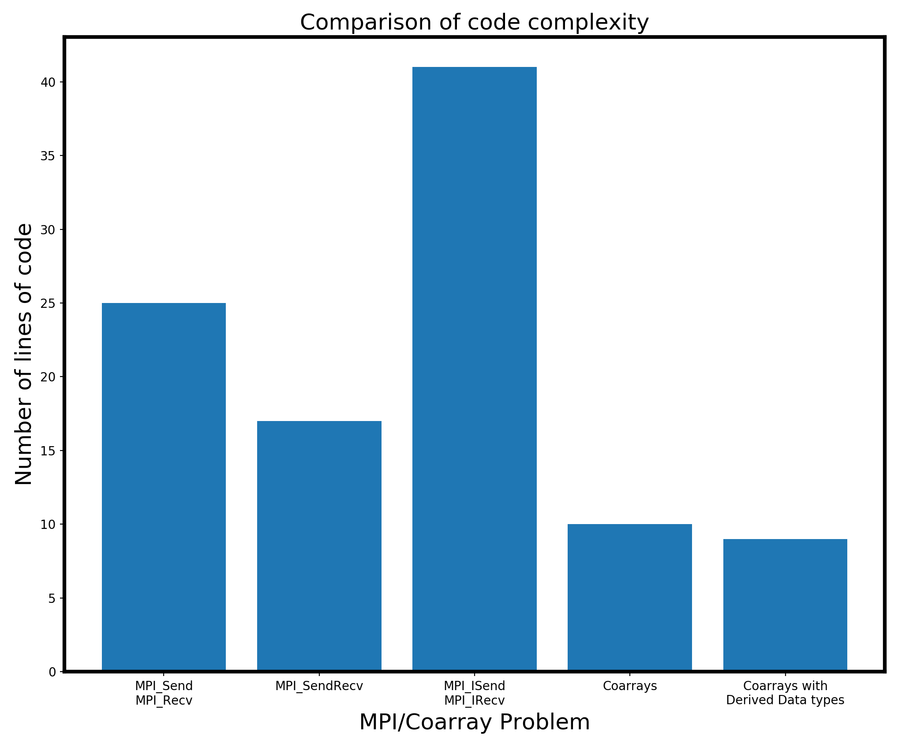

# Laplacian Smoothing with Coarray Fortran

For access to this project on
github,
[click here](http://github.com/rehnd/cme342/tree/master/project).


## 0. Overview
### 0.1 Coarray basics
This project uses Fortran's 2008/2015 standards, which include
specifications for _coarray_ Fortran. Coarrays allow code developers
to use state-of-the-art MPI constructs and parallelization without
ever having to call MPI subroutines or functions. 

The purpose of coarray Fortran is to abstract away tedious MPI calls
by allowing users to specify distributed variables with an extra
dimension in square brackets `[*]`. This extra square bracket allows
users to access elements within a given _codimension_.  A simple
example is the following:

``` fortran
program coarray_test
integer              :: i, n = 100
real(8), allocatable :: x(:)[:]  ! coarray x

allocate(x(n)[*]) ! Allocates x to be of size n on each codimension

do i = 1,n
   x(i) = i*this_image()
end do

print *, "Image ", this_image(), "of ", num_images(), " has x(1) = ", x(1)

deallocate(x)

end program
```

In this simple example, we create an allocatable coarray of size 100.
During runtime, the number of codimensions is determined by the number
of processes started up, just like in an MPI program. For example, we
would compile and then run the above code via

``` bash
$ caf -o coarray_test coarray_test.f90
$ cafrun -np 4 ./coarray_test
```

Here, we use the `caf` compiler, which is essentially a wrapper around
`mpif90`, as well as `cafrun`, which is very similar to `mpirun`.

As can be seen in the code above, coarray code takes a significant
burden off of the programmer in terms of what needs to be done to
start up a parallel program. Specifically, we can see the following
constructs that are "built-in" in the example code:

* Specification of coarrays via `varname[*]`
* `this_image()`: Returns the process/image id for each image
* `num_images()`: Returns the total number of images specified at runtime

These intrinsic functions are very convenient to use, but this does
not mean that coarray code is in any way restrictive of advanced MPI
features. Coarrays naturally use advanced MPI features 'under the
hood' which will be discussed later, but an important point is that
any coarray Fortran code can be modified to use any MPI functions or
subroutines that come built in to a particular MPI standard. For
example, it is perfectly valid to set up a new communicator in a
coarray code and program with standard MPI if desired. However,
coarrays are often a much better way to do things.

### 0.2 Purpose
There are several points for my doing this project:

1. Understand features of OpenCoarrays and how they compare to
   standard MPI. The specific features of coarrays I learned about are:
   - General coarray variables
   - Concurrency loops, exploting concurrency
   - One-sided communication aspects of coarray Fortran
   - Intrinsic functions in Coarray Fortran
   - Installation of `opencoarrays`
1. Implement hw1 in Coarray Fortran to learn the following:
   - How easy is coarray Fortran to use?
   - How many lines of code are required to perform similar MPI tasks?
   - How does the performance compare?

In addressing these points, I will cover four topics, devoting a
section below to each topic:

1. Concurrency loops
2. Runtime performance of MPI code vs. Coarray code
3. Comparison of number of lines of code/implementation difficulty
   between MPI and Coarray Fortran
4. Additional features of Coarray Fortran used (and not used) in this project

# 1. Concurrency loops
Coarray Fortran was specifically designed with the idea of
high-performance numerical computing in mind. A new construct called
`do concurrent` was added to the language, and this feature allows
users to gain added performance benefits when performing operations
that do not carry data dependencies. A simple example is adding two
vectors together. In the normal Fortran case, we would write

``` fortran
do i=1,n
   z(i) = x(i) + y(i)
end do
```

In Coarray Fortran, we can easily convert this loop to:

``` fortran
do concurrrent(i=1:n)
   z(i) = x(i) + y(i)
end do
```

By writing `do concurrent`, we specify to the compiler that there are
no data dependencies between `z(i)` and `z(j)` for `i` not equal to
`j`. This allows the compiler to optimize the loop for faster
performance. The particular form of optimization is completely up to
the compiler, but the two most important capabilities are: 1)
threading and 2) vectorization.  Currently in `gfortran`, the compiler
uses vectorization when using `do concurrent`. However, this syntax
could just as well enable threading under the hood, so that the `do
concurrent` loop above is essentially turned in to an OpenMP construct.

This optimization is the first example of how coarray Fortran provides
high performance with very easy-to-use syntax. In my project code, I
have loops that look as follows:

``` fortran
   ! Standard Fortran loop
   do j = 2, n2me-1 
      do i = 2, n1me-1
         a(i,j) = b(i,j) + epsilon*(                         & 
               b(i-1,j+1) +          b(i,j+1) + b(i+1,j+1) + & 
               b(i-1,j  ) - dble(8.)*b(i,j  ) + b(i+1,j  ) + & 
               b(i-1,j-1) +          b(i,j-1) + b(i+1,j-1)) 
       end do
    end do 
```

After modifying this, I have:

``` fortran
   ! Coarray concurrency loop
   do concurrent(j = 2:n2me-1)
      do concurrent(i = 2:n1me-1)
         a(i,j) = b(i,j) + epsilon*(                         & 
               b(i-1,j+1) +          b(i,j+1) + b(i+1,j+1) + & 
               b(i-1,j  ) - dble(8.)*b(i,j  ) + b(i+1,j  ) + & 
               b(i-1,j-1) +          b(i,j-1) + b(i+1,j-1)) 
       end do
    end do
```

The runtime performance of these two codes is shown below, using 1,2,
and 4 processors.


The reason here for the lower runtime of `do concurrent` is that the
compiler optimized the loop using vectorization. The nice part about
allowing the compiler to do this is that the code is portable across a
variety of machines, and each machine can have its own set of rules
for how to best optimize a `do concurrent` loop. Therefore, one
machine might use vectorization while another might implement
threading, depending on how the compiler decides to optimize the
code. This allows for fine-grained optimization for a particular
machine or computer architecture, while not sacrificing generality in
the code itself.

## 2. Runtime performance of MPI Fortran and Coarray Fortran
In the first homework assignment, we implemented a solution to the
Laplace smoothing algorithm using 3 different MPI constructs:

1. `MPI_Send` and `MPI_Recv`
2. `MPI_SendRecv`
3. `MPI_ISend` and `MPI_IRecv` (non-blocking)


### 2.1 Coarray implementation details
For this project, I implemented two different versions of Coarray
Fortran code. The first, referred to as `Coarrays`, does the
following:

* Allocate coarrays `a(:,:)[:]` and `b(:,:)[:]` of size `n1me =
  n1/np1` x `n2me = n2/np2` for each process
* Store edge data in contiguous arrays of size `n1me` or `n2me`
* Send the contiguous arrays using coarray send construct (more on
  this later).
  
The second version of coarray code is referred to as `Coarrays w/
Derived Datatypes`. This version does the following:

* Allocate coarrays `a(:,:)[:]` and `b(:,:)[:]` of size `n1me =
  n1/np1 + 2` x `n2me = n2/np2 + 2` for each process. This provides
  border cells that allow storage of the edge data within each array
* Send the border data using coarray constructs that implement Derived
  datatypes under the hood.
  
This second formulation allows for two significant advantages: 1) The
code is particularly simple to write since no contiguous border arrays
are needed and 2) MPI Derived data types are used under the hood.

The MPI derived datatypes used under the hood require further
explanation. When sending data under this `Coarrays w/ Derived
Datatypes` version, we have the following simple code:

``` fortran
  subroutine send_edges()

    ! Get N and S data
    if (nid(2) > 0)  b(n1me+2,:) = b(2,:)[nid(2)]
    if (nid(4) > 0)  b(1,:)      = b(n1me+1,:)[nid(4)]

    sync all

    ! Get W and E data
    if (nid(3) > 0)  b(:,n2me+2) = b(:,2)[nid(3)]
    if (nid(1) > 0)  b(:,1)      = b(:,n2me+1)[nid(1)]

    sync all
  end subroutine send_edges
```

Note that here `nid` is of size 4 and contains the neighbor id's of
all surrounding cells. If no cell exists to the left (`i=1`), bottom
(`i=2
`), right (`i=3`), or top (`i=4`), then `nid(i)` is set to -1.

In the above example, we first ask whether a neighbor to the South
(`nid(2)`) exists. If it does, we grab the first row of data from
`nid(2)`'s array and place it in the last row of our id.  This is done
via the line

``` fortran
b(n1me+2,:) = b(2,:)[nid(2)]
```

We can see exactly how simple coarray code is in this line. Under the
hood, this operation involves an `MPI_Get` call by one process,
requesting the second row of `b` on the process corresponding to
`nid(2)`.  Importantly, this is a _one-sided MPI communication_ under
the hood. (Generally, one-sided communication is more efficient than
two-sided communication.)

The other aspect of the above line that is very nice is that we are
sending _non-contiguous_ data. By grabbing the second _row_ of `b` in
image `nid(2)`, we are requesting values that are located `n1me+2`
values away in memory. Fortunately, coarrays implements MPI Derived
data types under the hood so that this noncontiguous block can be
sent.  This is a very significant advantage, since we know that MPI
derived datatypes are much faster on modern computer architectures,
due to the fact that modern processors use Remote Direct Memory Access
(RDMA). 

Overall, we see from this very simple line three great advantages of
Coarray Fortran:

1. One-sided MPI communication
2. MPI Derived datatypes used under the hood
3. Extremely simple syntax, no MPI calls

### 2.2 Performance comparison and analysis
We can now ask how the performance of the three versions of MPI listed
above compare with the two versions of coarray code compare.  The Wall
time of the three codes is shown in the Figure below.


Here, we see that between the 3 MPI implementations, the non-blocking
is the fastest, as we expect. The blocking routines are roughly the
same level of performance.

We see, however, that the Coarray Fortran code is faster than any of
the MPI implementations. 

I also studied the speedup for these 5 codes on a larger problem (one
for which `n1 = 4096`, `n2 = 4096`, as opposed to `n1 = n2 =
1024`. These results are shown in the figure below.



These can easily be turned into an efficiency plot:



Both the speedup and efficiency show roughly the same behavior for MPI
and Coarrays, meaning that there is nothing to lose by switching to
Coarray code. In most problems, we would actually expect coarray code
to outperform the MPI implementations in terms of speedup/efficiency.

### 2.3 Important note on runtimes
As can be seen above, I was only able to run the code on 1, 2, and 4
processors. The reason for this was a problem with the MPICH
installation on the cluster I was using. Since I was unable to get
MPICH to work correctly with the `caf` compiler on the cluster, I was
not able to obtain results on 8, 16 and more processors. I hope to
have time to install MPICH correctly at some point.

Because the cluster was not working correctly, I was forced to use a
virtual machine on my laptop to run the code. My laptop has 4 cores,
but even so, the virtual machine may have caused things to run much
slower than should be expected on my laptop. 

**Important Note:** _These considerations should explain why the
efficiency and speedup is so poor in the above plots._


## 3. Comparison of number of lines of code/implementation difficulty
Another important metric for comparing Coarray Fortran to standard MPI
Fortran is to look at the code complexity. As has already been
described, Coarray Fortran code has far simpler syntax than
traditional MPI Fortran. However, we can quantify this in a simpler
way by looking at the number of lines of code involved in each
case. The figure below presents the number of lines of code.



In the above figure, we count the lines of code for MPI and Coarray
Fortran in the following ways:

* **MPI Fortran:** Count the total number of lines that include
  `MPI`. This is almost entirely MPI commands, such as `MPI_Recv`,
  `MPI_Barrier`, etc. 
* **Coarray Fortran:** Count the number of `sync all` statements and
  any statements involving array assignment, for example:
  
  ```fortran
	  b(1,:) = b(n,:)[2]
  ```

As shown in the figure, Coarray Fortran requires many fewer lines of
code to perform essentially the same task. In fact, if we were to
implement MPI Derived Data types using standard MPI Fortran, we would
expect to have even more lines of MPI code than the 3 examples shown
above. In some sense, counting the number of lines of code is also a
_generous_ comparison for MPI.  If we were to count the number of
characters used in MPI code vs. coarray code, the discrepacnies in the
above figure would be even greater. Furthermore, it is difficult to
quantify debug time from a simple character/line count alone. Often
times, MPI code can be extremely tedious to debug, and the time spent
debugging might not always scale linearly with the number of lines or
characters. In these respects, Coarray Fortran offers a great
advantage.


## 4.  Additional features of Coarray Fortran
In addition to the Coarray features described above, there are several
features new to the Fortran 2015 standards that deserve mention. One
important addition is the ability to do collective communication
routines with coarrays.

The collective communication calls include:

* `co_sum` (collective sum): sum the elements of elements of a coarray
  on each image and store the result in a specified image
* `co_reduce` (collective reduction operation): similar to `co_sum`,
  but for a generic operation to be applied to all elements of a
  coarray.
* More examples...

Of the above, I ended up using only `co_sum` to compute the total norm
of the array. That syntax looks as follows:

``` fortran
norm = sum(a**2)

call co_sum(norm, result_image=1)

if (this_image() == 1) norm = sqrt(norm)
```

which stores the computed norm on image 1 (note that image 1 in
coarray Fortran is the first image -- not image 0, as is the case in
MPI Fortran).

In addition to these features, Coarray Fortran now (very recently) has
the ability to detect failed images. This is very important for
exascale computing, where the probability of a node failing becomes
much larger, due to the sheer number of processors running at a given
time. In these cases, it is important for the code to adapt and
respond to the failed images. Coarray Fortran, when built with very
recent versions of MPICH, includes the intrinsic function

``` fortran
failed_images()
```

as well as other features to assist with these scenarios. This is very
recent, and although I have not used this feature before, it should be
very useful for code developers as we approach exascale computing. 
